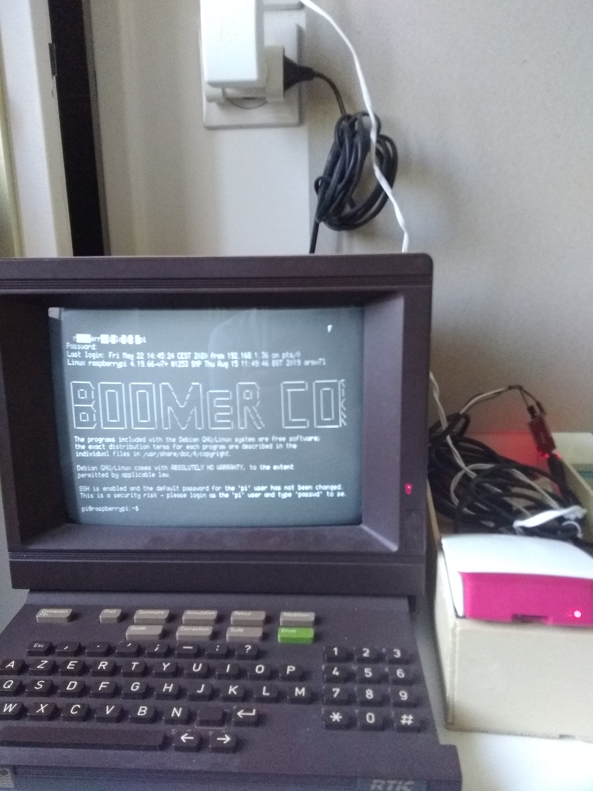
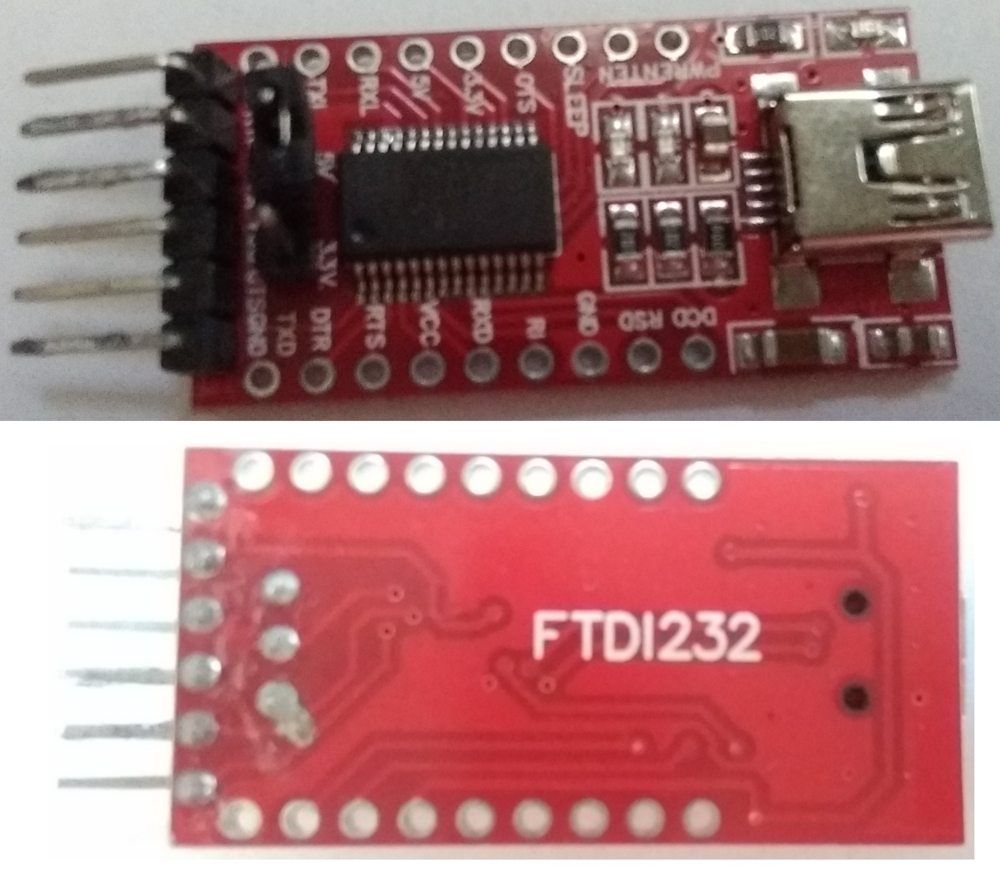
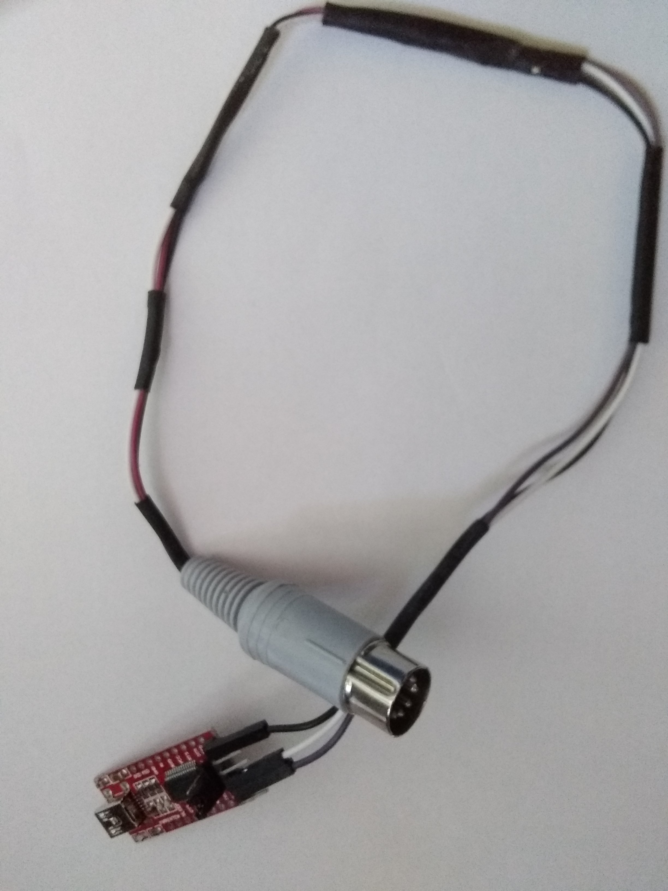
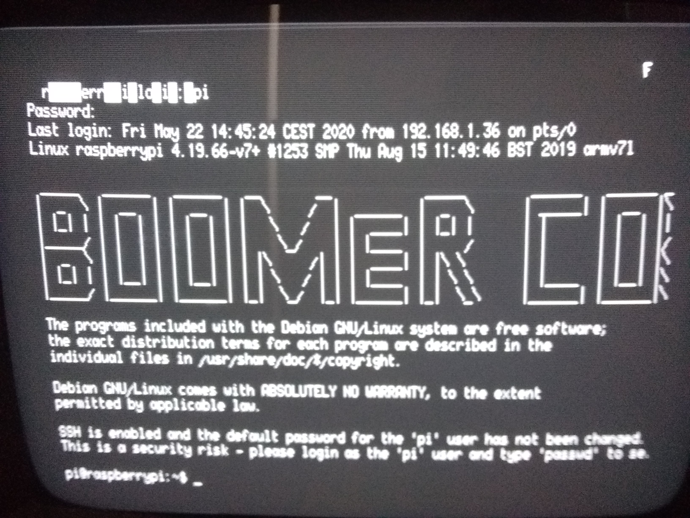

# Raspi-Mini
3615 Raspberry ;) ou comment redonner vie à un Minitel.

Ce projet a pour but d'utiliser un Minitel 1b comme écran et clavier d'un Raspberry-pi 3b+. Avoir un Minitel 1b est important car nous aurons besoin de la prise DIN pour la liaison et de la touche Fct pour passer en mode Télé-informatique et régler la connexion.

## Liaison série
La connexion entre les 2 appareils se fait à l'aide d'une liaison série : USB du côté de l'ordinateur et DIN du côté du Minitel. Si il s'agit dans les deux cas d'une liaison série, le protocole est légèrement différent. Le Minitel fonctionne avec la norme TTL là où l'USB fonctionnne avec sa propre norme. Un convertisseur TTL <=> USB est donc nécessaire. J'utilise pour ce projet un FTDI232.

ATTENTION : LE CONVERTISSEUR DOIT ETRE EN MODE 5V ET NON 3.3V !!!

 
 
 
 
 ## Hardware
Un vieux câble DIN soudé à des connecteurs dupont femelle pour permet de lier le Minitel et le FTDI232. De l'autre côté un simple câble USB vers mini-USB suffit.

 
 
 ## Software
 Afin de permettre l'affichage de l'écran et la capture du clavier via le port USB, il est nécessaire de modifier le système de boot de Raspbian (OS utilisé sur le Raspberry-pi. Seul un OS en mode console peut être utilisé les interfaces graphiques ne pouvant s'afficher sur le Minitel). Pour cela j'ai suivi le tutoriel de <a href="http://pila.fr/wordpress/?p=1145">Pila</a>. (Le fichier de systemd est disponible dans le projet).
 
 Une fois le Raspberry-pi redémarré et les câbles branchés, quelques manips s'imposent :
 - Allumer le Minitel et attendre que l'écran chauffe (un F doit apparaitre en haut à droite de l'écran)
 - Appuyer simultanément sur les touches <b>Fnct</b> et <b>T</b> puis sur la touche <b>A</b>. (Permet de passer sur la prise DIN).
 - Faire de même avec la touche <b>E</b> à la place de la touche <b>A</b>. (Enlève l'echo local du Minitel).
 - Enfin appuyer simultanément sur les touches <b>Fnct</b> et <b>P</b> puis <b>4</b> pour passer en 4800 bauds.
 
 Le sytème est prêt ! 
 La première ligne peut être illisible avec des caractères blancs, cela est normal, dés la 2e ligne tout entre dans l'ordre.
 
 
 Ces manipulations doivent être faites à chaque fois car le Minitel ne possède pas de mémoire pour stocker sa configuration actuelle :(.
 
